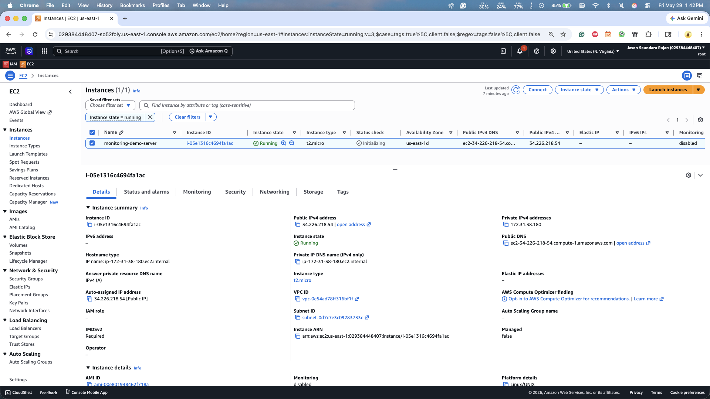
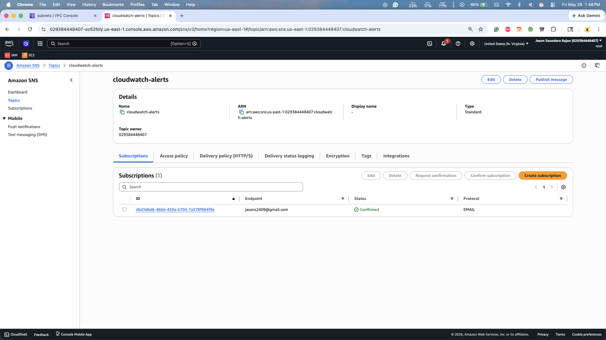
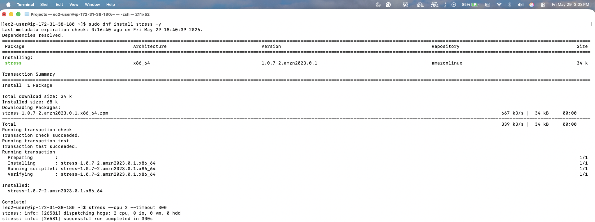
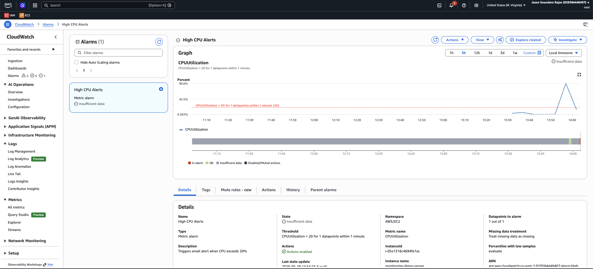
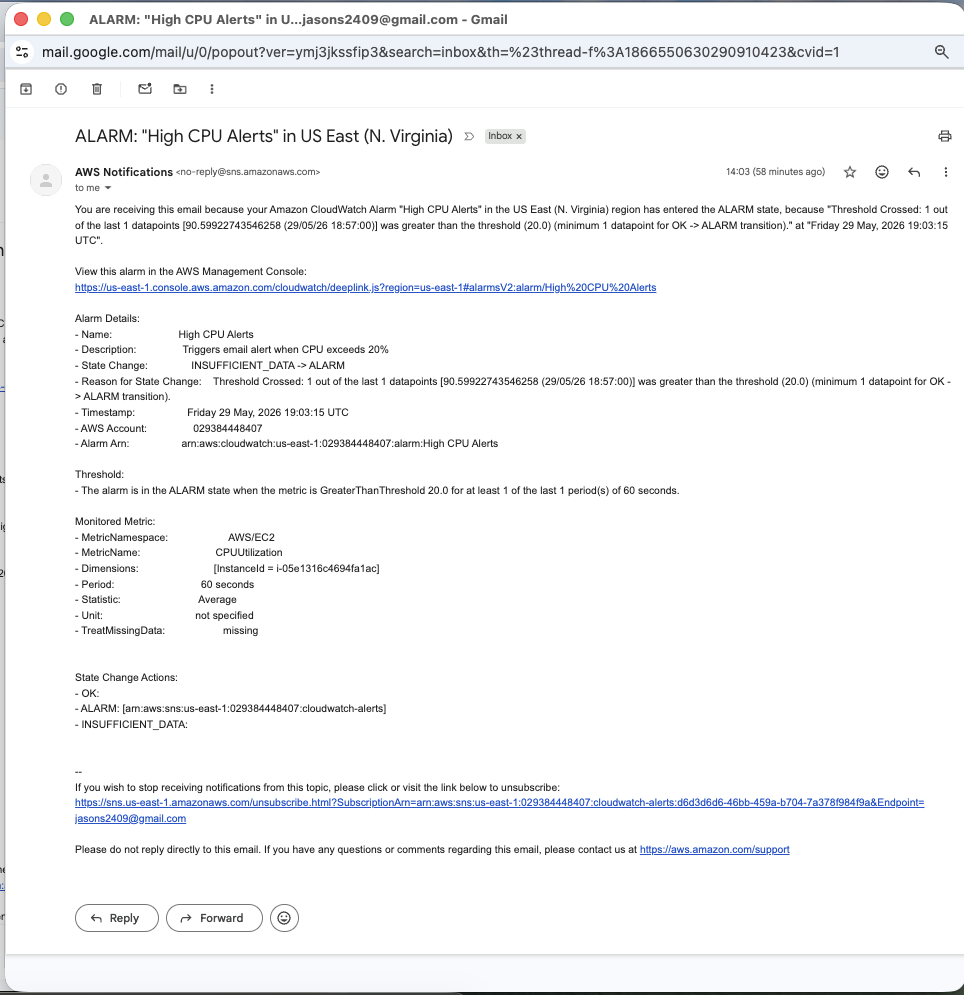

# AWS CloudWatch Monitoring & Alerting

## Project Overview

This project demonstrates proactive infrastructure monitoring using Amazon CloudWatch and Amazon SNS.

An Amazon EC2 instance was deployed and monitored using CloudWatch metrics. A CloudWatch alarm was configured to monitor CPU utilization and automatically send email notifications through Amazon SNS when the CPU usage exceeded a defined threshold.

The project validates real-world monitoring, alerting, and incident notification workflows commonly used in cloud operations and DevOps environments.

---

## Architecture

EC2 Instance
        |
        v
CloudWatch Metrics
        |
        v
CloudWatch Alarm
        |
        v
Amazon SNS Topic
        |
        v
Email Notification

---

## Technologies Used

- Amazon EC2
- Amazon CloudWatch
- Amazon SNS
- Amazon Linux 2023
- Linux Administration
- SSH
- Git & GitHub

---

## Project Objectives

- Deploy and manage an EC2 instance
- Monitor infrastructure performance using CloudWatch
- Configure metric-based alarms
- Implement automated notifications using SNS
- Simulate production incidents using CPU stress testing
- Validate end-to-end monitoring workflows

---

## Implementation Steps

### 1. EC2 Deployment

- Launched Amazon Linux 2023 EC2 instance
- Configured Security Group for SSH access
- Connected using SSH key pair

### 2. SNS Configuration

Created SNS Topic:

cloudwatch-alerts

Added Email Subscription:

jasons2409@gmail.com

Confirmed subscription through email verification.

### 3. CloudWatch Alarm Configuration

Created alarm:

High CPU Alerts

Configuration:

- Metric: CPUUtilization
- Namespace: AWS/EC2
- Threshold: Greater than 20%
- Evaluation Period: 1 Minute
- Action: Send notification to SNS topic

### 4. CPU Stress Test

Installed stress utility:

sudo dnf install stress -y

Generated CPU load:

stress --cpu 2 --timeout 300

This artificially increased CPU utilization to trigger the CloudWatch alarm.

### 5. Alert Validation

CloudWatch detected the threshold breach and changed the alarm state from:

INSUFFICIENT_DATA → ALARM

SNS successfully delivered email notifications.

---

## Screenshots

### EC2 Instance

### SNS Topic Configuration

### CPU Stress Test

### CloudWatch Alarm Triggered

### Email Alert Notification

---

## Key Learning Outcomes

- Amazon CloudWatch monitoring
- CloudWatch metric alarms
- SNS notification workflows
- Infrastructure observability
- Linux performance testing
- Incident detection and alerting
- Real-time monitoring best practices

---

## Resume Highlights

- Implemented infrastructure monitoring using Amazon CloudWatch and Amazon SNS.
- Configured CPU utilization alarms and automated email notifications.
- Simulated high CPU workloads using Linux stress testing tools.
- Validated end-to-end monitoring and incident alerting workflows.
- Gained hands-on experience with cloud observability and operational monitoring.

---

## Author

Jason Soundara Rajan

AWS Cloud Engineering Portfolio Project